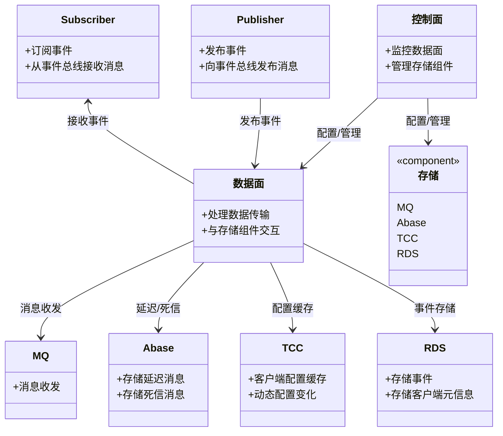
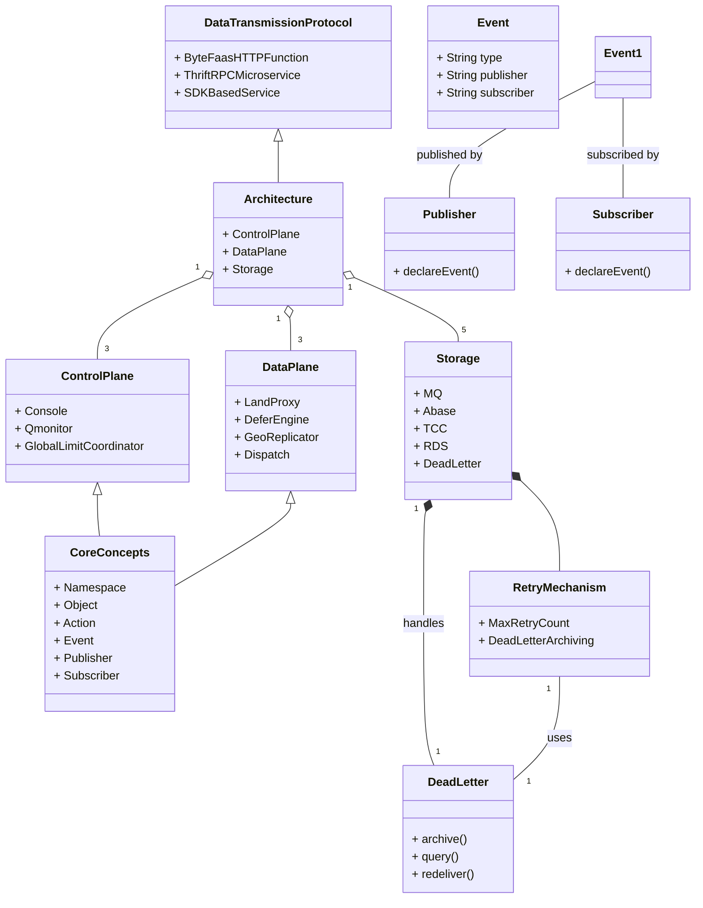
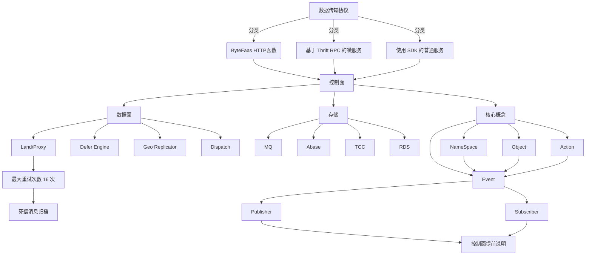
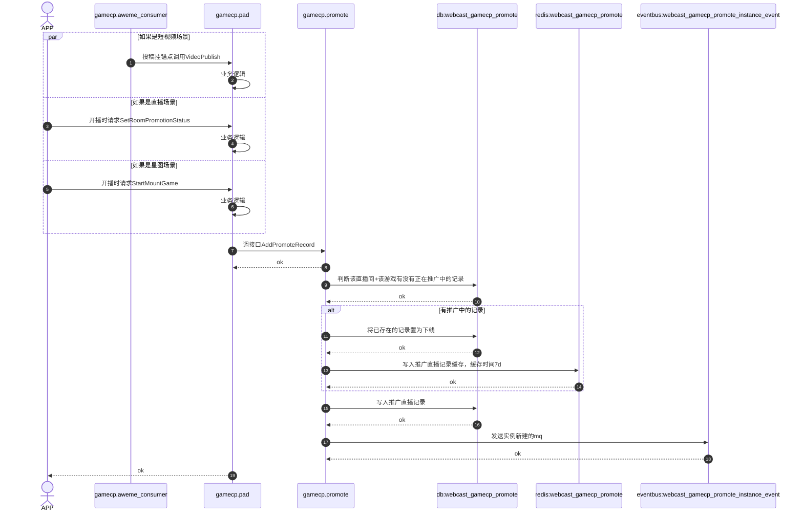

### 开发环境配置
#### 方式一 #开发环境配置 （推荐）
1. 搭建MAC本地开发环境
2. GoLand搭建CloudDev环境 配置BOE环境
3. 注意，这里BOE可以理解为是测试环境，所有代码的测试、联调、运行、Debug都是在BOE环境中进行
4. 
#### 方式二 
1. 远程开发机配置开发
2. VsCode链接开发机进行开发
3. ![[Pasted image 20240506142232.png]]
#### 云桌面：
tongmeng.dy
MT.1234
## 工具相关&网站
- [CloudIDE](https://cloud.bytedance.net/cloudide/environments?x-resource-account=public)
- [CloudDEV](https://bits.bytedance.net/clouddev/interface_test?address=&api=GetOperationLogs&cluster=default&env=prod&form_type=RPC&http_method=GET&idc=boe&idl_source=1&idl_version=feat_newbee_tongmeng&protocol=https%3A%2F%2F&psm=webcast.newbee.core&test_plane=2&zone=BOE)
- [直播PB](https://code.byted.org/webcast/rpc_idl)

## 开发问题汇总
1. 客户端如何寻址到后台结构
2. 后台上线流程
3. 监控告警系统
4. Janux 前端交互 [前端协议转换](https://cloud.bytedance.net/bam/rd/webcast.gamecp.promote/idl?x-resource-account=public&cluster=default&version=1.0.1142)
5. BOE部署了服务 但是在测试接口时报错： 
	找不到服务地址，可能的原因: 1.psm不存在; 2.psm未注册consul (sd lookup {service_name} 为空), 可能是tce服务没有配置监听端口; 3.检查是否cluster/env 信息有误。 如果是在测试，可以尝试输入自定义地址 -- 已解决
6. 部分业务场景&名词不太熟悉 -- 待沟通
7. 技术方案评审：
   - @评审机器人
   - meego:
   - 技术方案：

## 开发流程 & 规范
1. 后台更新协议(webcast_idl) $\rightarrow$ overpass根据个人分支生成代码([overpass](https://overpass.bytedance.net/idl_info?s=webcast.newbee.core)) $\rightarrow$ [bam导入IDL](https://cloud.bytedance.net/bam/rd/webcast.game.tmtest/api_doc/new_api_doc?x-resource-account=public)
2. GoLand可以搭建BOE环境测试接口
3. 使用Jsonx 并且 尽量函数要写通用
4. CR流程标准：
	1. 如果定义了新接口，接口定义完需要提交一次CR
	2. 完成接口或者函数实现，如果新增代码过多 需要拆分进行CR
	3. 完成BUG修复需要CR
5. handler 使用glog打印日志 其他使用logv2打印日志
6. 打点使用metric

### GoLand拉取代码仓库失败

1. fatal: Could not read from remote repository. 
	- 大概率是证书过期了 可以使用klist查看本地电脑证书是否过期，如果过期使用命令：
	```bash
	  kinit tongmeng.dy@BYTEDANCE.COM
	```

#### 研发流程重点
- 需求文档梳理 $\rightarrow$ [绑定TCE&新建研发环境](https://bytecycle.bytedance.net/space/webcast_deploy/module/demand/demand/3159521873/detail?active=process&feature_space_id=dygame1)$\rightarrow$ 建立远端分支和本地分支
- 通过[直播联调平台](https://bytecycle.bytedance.net/space/webcast_deploy/)绑定对应的项目创建BOE和PPE环境，同时创建对应分支，这里是开发环节
![[Pasted image 20240416151432.png]]
- 更新IDL文件需要去[直播研发平台](https://webcast-dev.bytedance.net/)进行创建
- 根据远端的分支如`feat_game_xigua_send_notice`创建本地dev分支`dev_feat_game_xigua_send_notice` 进行开发

## 本地开发相关文件
- Navicate root TM.123
- AweMe 抖音 1128 西瓜 32
- AnchorID 主播ID
- AnchorSettleInInfo 入驻信息 一个UID可能对应多个平台入驻信息
- MGetAnchorSettleInInfo 作者同意协议入驻AppID列表 获取到的列表即是已经同意合约的APPID列表
- MGetAccountConnectInfoByUserId：通过抖音APPID换取第三方UserID


## 组件学习归纳

### Kitex

- kitex 默认会将生成代码生成在当前目录（也就是 $EXAMPLE_PATH）。这里简单说明一下参数的含义：
- `-module`参数应和 `go.mod` 文件中的 module name 相同，在本例中为 code.byted.org/your_name/kitex_example
- 常用的module参数为  code.byted.org/sysmodulename/func 举例： 
- kitex -module code.byted.org/game/tmtest \\n -service webcast.game.tmtest 
- ~/go/src/code.byted.org/webcast/rpc_idl/webcast/test/tm_test.thrift
-  `-service`参数表明需要生成服务端代码，建议指定为服务端的`PSM`（[什么是"PSM"](https://bytedance.larkoffice.com/wiki/wikcn2ZAtBJMFXuZi70ftWovxgc?bk_entity_id=enterprise_129)），在本例中为 `kitex.thrift.example`；
- - IDL 文件**必须是最后一个参数**，在本例中为 `idl/kitex_greet.thrift`。


```zsh
cd $EXAMPLE_PATH

kitex -module code.byted.org/your_name/kitex_example \
    -service kitex.thrift.example idl/kitex_greet.thrift

# this is necessary since v0.14.0+ is not compatible with Kitex
# Refer to doc "not enough arguments" error for more information
go mod edit -replace=github.com/apache/thrift=github.com/apache/thrift@v0.13.0

go mod tidy
```


### AnyCache 
- 类似的缓存有[[OpenSource & CodeSource#GroupCache 学习看板 源码学习 学习看板|GroupCache]]
### EventBus学习归纳
- 按照数据传输协议可以分为三大类：ByteFaas HTTP函数、基于 Thrift RPC 的微服务和使用 SDK 的普通服务
- 架构组成：控制面、数据面、存储
	- 控制面
		- Console，控制台，用于时间场景、Schema、客户端、配置和权限管理
		- Qmonitor，底层队列监控，定期拉取topic/consumer offset信息，抛出统一埋点
		- Global Limit Coordinator，全局限流器，用于实现生产和消费侧的全局限流功能。
	- 数据面
		- Land/Proxy，负责客户端的直接接入，功能有熔断限流、过滤裁剪、延迟、重试等。
		- Defer Engine，用于处理普通延迟消息、消费重试消息和死信消息。
		- Geo Replicator， 完成时间在不同区域间的同步
		- Dispatch，对传输协议进行转换，支持ByteFaaS函数和Thrift RPC服务接入
	- 存储：
		- MQ：用于消息的普通收发
		- Abase：存储延迟消息和死信消息
		- TCC： 配置客户端配置缓存和动态变化
		- RDS：存储事件和客户端元信息
		-  允许设置的**最大重试次数为 16 次**，超出后支持归档为死信消息，死信消息可按需查询和重投
- 核心概念
	1. NameSpace：用于区分不同的产品和功能模块
	2. Object：描述Event所涉及的对象，如用户注册事件，Object为User
	3. Action：描述Object所涉及的操作，如用户注册事件，Action为注册
	4. Event：类型由NameSpace、Object、Action三部分拼接而成，全局唯一。如：**tiktok.webcast.room.chat**
	5. Publisher：发布者即事件源，用于向事件总线发布特定类型的事件，发布前需要在**控制面提前说明**。
	6. Subscriber：订阅者，也需要在控制面提前说明。





- 其中EventBus的底层使用的消息队列为[[ByteDance#^c57a0b|Kafka]]、[[ByteDance#^061de3|Rocket]]、NSQ、BMQ


- [Demo示例](https://bytedance.larkoffice.com/wiki/wikcn1CyHfy9UgYFRGC1XPMYMxh)
- SDK代码示例
```Go
package main
import (
    "context"
    "os"
    "os/signal"
    "syscall"
    "time"
    "code.byted.org/gopkg/logs"
    eventbus "code.byted.org/eventbus/client-go"
)

func main() {
   eventName := "event_name"
   event := eventbus.NewProducerEventBuilder().
      WithEventName(eventName). // 必填：指定消息要发送的event
      WithValue([]byte("Publish hello")).
      WithKey([]byte("partition key")). // 消息key
      Build()

    // 同步发送
    // publish时会懒创建producer，24h不用后自动删除，不用担心会new太多个producer
   err := eventbus.Publish(context.Background(), event)
   if err != nil {
      logs.Infof("%v", err)
   }
 }
```
### Janus Mini [文档](https://bytedance.larkoffice.com/wiki/wikcnAtyLmOJwCzOuFUBQyHZ2oc)
- Janus内部会对错误码进行修改，不能返回业务错误码，返回业务错误码给前端需要借助"agw.preserve_base"注解，并且wError不能进行starling翻译
- 常用的注解包括：api.get、api.post、api.put、api.delete、api.serializer
- 不加注解或者agw.key注解的字段取值顺序：依次从api的url -> post -> query -> header -> body json中找
### Metrics
- 命名规范：允许字符为`a-zA-Z0-9._-/:%` 注意不能有空格，推荐格式为至少三段式：`<psm>.<function>.<function_description>`  `eg:inf.abase.append_rx_bytes`
- 

### Golang源码解析 [[Language/GoLang|相关总结]]
### TLB 七层负载均衡
- 可将访问域名的流量通过不同路由分发到对应的后端应用。在七层负载均衡中，可进行域名的申请并接入到不同类型如TCE、自定义的后端服务中。
- **Consul** Consul是TCE服务的服务注册中心，所有的TCE实例都会注册到Consul中。TLB是基于Consul的能力进行服务发现，所有注册在Consul中的实例TLB均可直接查询对应的IP与端口。让TLB的用户可在针对Consul注册的服务进行流量接入时更便捷高效的进行配置。
#### Slice 
##### Go Slice 源码分析

Go语言的slice结构体定义在`runtime/slice.go`文件中，其核心结构如下：

```go
type slice struct {
    array unsafe.Pointer // 指向底层数组的指针
    len   int             // slice的长度
    cap   int             // slice的容量
}
```

slice的创建通常通过`make`函数或者直接通过数组的切片操作来完成。`make`函数的源码实现如下：

```go
func makeslice(et *_type, len, cap int) unsafe.Pointer {
    // ...内存分配和初始化操作...
    return mallocgc(mem, et, true)
}
```

slice扩容的机制在`growslice`函数中实现，当slice的容量不足以添加新元素时，会触发扩容操作：

```go
func growslice(et *_type, old slice, cap int) slice {
    // ...扩容逻辑，包括计算新容量、内存分配和数据拷贝...
    return slice{p, old.len, newcap}
}
```

##### 常见用法

1. **创建Slice**：
   ```go
   // 使用make函数创建一个长度为0，容量为3的int类型的slice
   slice := make([]int, 0, 3)
   ```

2. **追加元素**：
   ```go
   // 向slice中追加元素
   slice = append(slice, 1, 2, 3)
   ```

3. **切片操作**：
   ```go
   // 获取slice的一个子序列
   subSlice := slice[1:4] // 从第二个元素开始到第四个元素
   ```

4. **遍历Slice**：
   ```go
   // 遍历slice中的每个元素
   for i := range slice {
       fmt.Println(slice[i])
   }
   ```

5. **修改Slice元素**：
   ```go
   // 修改slice中的元素
   slice[0] = 10
   ```

##### 可能出现的错误用法

1. **超出Slice长度访问**：
   ```go
   // 错误的访问方式，可能会导致panic
   value := slice[10] // slice的长度小于11
   ```

2. **修改从函数返回的Slice**：
   ```go
   func f(s []int) {
       s[0] = 10 // 这只会修改传入的slice的副本，不会影响原始slice
   }
   ```

3. **忘记Slice扩容可能导致的性能问题**：
   ```go
   // 频繁的append操作，没有预先分配足够的容量，会导致多次扩容
   slice := make([]int, 0, 1)
   for i := 0; i < 1000; i++ {
       slice = append(slice, i)
   }
   ```

4. **错误的容量判断**：
   ```go
   // 错误的判断方式，cap是slice的总容量，不是剩余空间
   if cap(slice) == 0 {
       // 错误，这会判断slice是否已经扩容到其最大容量
   }
   ```
**注意事项** [[Language/GoLang#^727187|注意边界处拷贝]]

- Map
- sync.Map
- SingleFlight[[代码实现#SingleFlight源码|源码]]


#### SingleFlight
- 主要结构体：call、Group、Result
- 主要函数：Do、DoChan、doCall、Forget
- 源码解析：
```go

type Result struct {
	Val interface{}
	Err error
	Shared bool
}

type call struct {
	wg sync.WaitGroup
	val interface{}
	err error
	
	// These fields are read and written with the singleflight
	// mutex held before the WaitGroup is done, and are read but
	// not written after the WaitGroup is done.
	
	dups int
	chans []chan <- Result
}

type Group struct {
	mu sync.Mutex // protect m
	m map[string]*call
}


func (g *Group) Do(key string, fn func() (interface{}, error)) (v interface{}, err error, shared bool) {
	g.mu.Lock()
	if g.m == nil {
		g.m = make(map[string]*call)
	}
	if c, ok := g.m[key]; ok {
		c.dups++
		g.mu.Unlock()
		c.wg.Wait() // 当前key存在，则等待协程结束
	
		if e, ok := c.err.(*panicError); ok {
			panic(e)
		} else if c.err == errGoexit {
			runtime.Goexit()
		}
		return c.val, c.err, true
	}
	c := new(call)
	c.wg.Add(1)
	g.m[key] = c
	g.mu.Unlock()

	g.doCall(c, key, fn) // 真正的调用
	return c.val, c.err, c.dups > 0
}

func (g *Group) doCall(c *call, key string, fn func()) (interface{}, error) {
	normalReturn := false
	recorved := false

	
}


```
#### timer & tricker
在 Go 中，定时器（`time.Timer`）和间隔定时器（`time.Ticker`）是用于处理定时任务的重要工具。它们都基于 `time` 包实现，提供了在指定时间或间隔内执行代码的功能。

##### time.Timer
`time.Timer` 表示一个单次定时器，它会在指定的时间段过去后向其自身的通道（`<-chan time.Time`）发送当前时间。通过这种方式，你可以在指定时间后执行相应的操作。通常情况下，你可以通过 `time.After` 方法来创建一个定时器，并使用 `time.Timer` 的 `Reset` 方法重置定时器的时间。

```go
timer := time.NewTimer(5 * time.Second) // 创建一个 5 秒的定时器
<-timer.C // 在定时器的通道上等待，直到定时器到期
fmt.Println("Timer expired")
```

如果你需要提前停止定时器，可以使用 `Stop` 方法：

```go
timer := time.NewTimer(5 * time.Second)
if !timer.Stop() {
    <-timer.C // 如果定时器已经到期，需要将它的事件读取掉
}
fmt.Println("Timer stopped")
```

##### time.Ticker
`time.Ticker` 表示一个间隔定时器，它会在固定的时间间隔内重复向其自身的通道发送时间。你可以使用 `time.NewTicker` 来创建一个间隔定时器，然后通过它的通道 `C` 来接收定时的事件。使用 `Stop` 方法可以停止定时器。

```go
ticker := time.NewTicker(1 * time.Second) // 创建一个每秒触发一次的定时器
go func() {
    for range ticker.C {
        fmt.Println("Tick at", time.Now())
    }
}()
```

在不再需要定时器时，记得调用 `Stop` 方法来释放资源：

```go
ticker := time.NewTicker(1 * time.Second)
defer ticker.Stop() // 确保在函数结束时停止定时器
```

这就是 Go 中定时器和间隔定时器的基本使用方法。使用它们可以很方便地实现各种定时任务的需求。

Go语言的定时器和间隔定时器的实现源码都在 `time` 包中。下面我们来简要介绍一下它们的实现以及最重要的地方。

##### time.Timer 的实现

`time.Timer` 的定义如下：

```go
type Timer struct {
    C <-chan Time
    r runtimeTimer
}
```

其中，`runtimeTimer` 是一个私有类型，它实际上是一个指向运行时的定时器的指针。`C` 字段是一个只读通道，用于接收定时器到期的事件。

`time.Timer` 的主要方法是 `NewTimer`、`Reset` 和 `Stop`。

- `NewTimer` 方法用于创建一个新的定时器，并在指定的时间段过去后向其通道发送当前时间。
- `Reset` 方法用于重置定时器的时间。如果定时器尚未触发，它将返回 `true`；如果定时器已触发或停止，它将返回 `false`。
- `Stop` 方法用于停止定时器。如果定时器尚未触发，它将返回 `true`；如果定时器已触发或停止，它将返回 `false`。

`time.Timer` 的核心逻辑在 `runtime` 包中实现，主要涉及底层定时器的调度和管理。

##### time.Ticker 的实现

`time.Ticker` 的定义如下：

```go
type Ticker struct {
    C <-chan Time
    r runtimeTimer
}
```

`time.Ticker` 类似于 `time.Timer`，不同之处在于它会在固定的时间间隔内重复触发事件。它的主要方法是 `NewTicker` 和 `Stop`。

- `NewTicker` 方法用于创建一个新的间隔定时器，每隔一段时间就向其通道发送当前时间。
- `Stop` 方法用于停止间隔定时器的触发。

`time.Ticker` 的实现方式和 `time.Timer` 类似，但在内部使用了一个循环来定期触发事件。

### Mesh VS 负载均衡
#### 什么是Mesh？

Mesh在计算机网络和软件架构中通常指的是服务网格（Service Mesh）。服务网格是一种专门用于处理微服务之间通信的基础设施层，它负责管理服务间的网络通信，提供了服务发现、负载均衡、故障恢复、度量和监控等功能。

#### Mesh的作用

服务网格的主要作用和功能如下：

1. **服务发现**：服务网格可以自动检测和跟踪网络中所有的服务实例，无需手动配置。它为每个服务提供一个唯一的网络地址，使得服务之间可以轻松地找到彼此。

2. **负载均衡**：服务网格可以在多个服务实例之间分配流量，均衡负载，避免某个服务实例过载。这可以提高系统的稳定性和性能。

3. **故障恢复**：服务网格可以实现自动故障转移、重试和熔断等功能，增强系统的容错能力。例如，当某个服务实例不可用时，服务网格可以自动将流量转发到其他可用的实例。

4. **安全性**：服务网格提供服务间的安全通信，包括认证、授权和加密。它可以通过安全策略管理服务间的访问控制，确保数据在传输过程中的安全。

5. **监控和可观测性**：服务网格收集并报告服务间通信的度量数据，如延迟、错误率和流量量等。这些数据可以用于监控系统的健康状况、诊断问题并优化性能。

6. **流量管理**：服务网格可以进行流量控制和路由管理，比如实现灰度发布、A/B测试和流量镜像等高级流量管理策略。

#### 服务网格的典型实现

一些流行的服务网格实现包括：

1. **Istio**：一个开源的服务网格实现，提供了丰富的功能和灵活的配置选项，广泛应用于Kubernetes环境。
2. **Linkerd**：另一个开源的服务网格，设计简洁，易于部署，主要用于Kubernetes。
3. **Consul Connect**：由HashiCorp提供的服务网格解决方案，与Consul的服务发现和配置管理功能紧密集成。

#### 服务网格的工作原理

服务网格通常由两个主要组件组成：

1. **数据平面（Data Plane）**：由一组轻量级的代理（通常称为sidecar代理）组成，这些代理与每个服务实例一起部署。数据平面负责拦截服务间的所有网络流量，并执行服务网格的功能，如负载均衡、故障恢复和安全性等。

2. **控制平面（Control Plane）**：管理和配置数据平面代理，提供策略配置、服务发现和全局视图等功能。控制平面还收集和分析来自数据平面的度量数据。

通过以上方式，服务网格将网络通信逻辑从应用代码中分离出来，使得开发者可以专注于业务逻辑，同时提高了系统的可靠性、可管理性和安全性。


#### Mesh 和 负载均衡的区别

服务网格（Mesh）和负载均衡（Load Balancing）是两个不同但相关的概念，常用于分布式系统和微服务架构中。它们的功能有所重叠，但侧重点和范围不同。

#### 1. 负载均衡

负载均衡是一种在多个服务器之间分配网络流量的技术，以确保没有任何单个服务器过载。这有助于提高系统的可靠性和性能。

##### 主要功能：

- **流量分配**：在多个服务器或服务实例之间均匀分配请求。
- **高可用性**：在某个服务器或服务实例发生故障时，将流量重新分配到其他可用实例。
- **扩展性**：通过添加更多服务器或实例来处理增加的流量需求。

##### 类型：

- **硬件负载均衡**：使用专用的硬件设备，如F5 Big-IP。
- **软件负载均衡**：使用软件解决方案，如Nginx、HAProxy、Traefik等。
- **DNS负载均衡**：通过DNS解析，将请求分配到不同的数据中心或地理位置。

#### 2. 服务网格（Mesh）

服务网格是一种用于微服务架构的基础设施层，负责管理和优化服务之间的通信。它不仅提供负载均衡功能，还涵盖了服务间通信的许多其他方面。

##### 主要功能：

- **服务发现**：自动检测和追踪网络中所有的服务实例。
- **负载均衡**：在多个服务实例之间分配流量（与传统负载均衡功能相同）。
- **故障恢复**：实现自动故障转移、重试和熔断。
- **安全性**：提供服务间的认证、授权和加密通信。
- **监控和可观测性**：收集并报告服务间通信的度量数据，如延迟、错误率和流量量。
- **流量管理**：高级流量控制和路由管理，如灰度发布、A/B测试和流量镜像。

##### 典型实现：

- **Istio**
- **Linkerd**
- **Consul Connect**

#### 区别总结

1. **功能范围**：
   - **负载均衡**：主要关注在多个实例之间分配流量，确保高可用性和扩展性。
   - **服务网格**：涵盖了负载均衡的功能，同时提供服务发现、故障恢复、安全性、监控和高级流量管理等。

2. **实施方式**：
   - **负载均衡**：通常作为独立的组件，可以是硬件设备或软件服务，前端或者内部服务之间使用。
   - **服务网格**：作为基础设施层，通常通过sidecar代理（如Envoy）与每个服务实例一起部署。

3. **使用场景**：
   - **负载均衡**：适用于需要简单流量分配和高可用性的场景。
   - **服务网格**：适用于复杂微服务架构，需要全面管理和优化服务间通信的场景。

#### 实际应用

在现代微服务架构中，服务网格可以看作是负载均衡功能的超集。它不仅实现了负载均衡，还提供了许多额外的功能，使得服务间通信更加可靠、安全和可管理。因此，对于简单的应用，传统负载均衡可能就足够了；但对于复杂的微服务应用，服务网格是一个更全面的解决方案。
在拥有服务网格（Mesh）的情况下，是否还需要单独的负载均衡器取决于具体的使用场景和系统架构。以下是一些关键点，可以帮助理解在使用服务网格的环境中负载均衡器的作用和需求。

#### 服务网格中的负载均衡

服务网格本身提供了内部服务间通信的负载均衡功能。例如，Istio 使用 Envoy 代理来处理服务之间的通信，并提供了内置的负载均衡策略，如轮询（Round Robin）、随机（Random）、加权最小请求（Weighted Least Request）等。

#### 负载均衡器的作用

尽管服务网格提供了强大的内部负载均衡功能，外部负载均衡器仍然在一些场景中扮演着重要角色：

1. **入口流量管理**：
   - **入口网关（Ingress Gateway）**：服务网格通常包含一个入口网关，负责处理外部流量进入集群。这种网关通常使用负载均衡器来分配流量到网格内部的不同服务实例。
   - **外部负载均衡**：在流量进入服务网格之前，可能需要使用外部负载均衡器（如云提供商的负载均衡服务，Nginx，HAProxy 等）来管理从互联网或其他网络到服务网格入口的流量。

2. **多集群或多数据中心环境**：
   - **跨集群流量**：在多集群或多数据中心部署中，可能需要外部负载均衡器来分配流量到不同的集群或数据中心，并确保高可用性和容错能力。

3. **协议转换和高级流量管理**：
   - **协议转换**：外部负载均衡器可以处理一些服务网格内部代理可能不支持的协议转换，如 HTTP 到 HTTPS，TCP 到 HTTP 等。
   - **高级流量管理**：某些外部负载均衡器提供了高级功能，如全局流量管理、地理位置路由和 DDoS 保护等，这些功能可能超出了服务网格的直接能力范围。

4. **性能和可用性优化**：
   - **性能**：在某些高性能需求的场景中，专用的硬件或软件负载均衡器可能在流量分配和处理能力上提供更高的性能和更低的延迟。
   - **可用性**：外部负载均衡器可以增强系统的可用性，特别是在服务网格出现问题或需要维护时，作为冗余机制。

#### 综上所述

尽管服务网格内置了强大的负载均衡功能，外部负载均衡器在以下场景中仍然是必要的：

1. 管理外部流量进入服务网格的入口。
2. 在多集群或多数据中心环境中分配跨集群流量。
3. 实现协议转换和高级流量管理。
4. 提供额外的性能优化和可用性保障。

因此，服务网格和负载均衡器是互补的技术。在大多数复杂的微服务架构中，两者通常会同时使用，以充分利用各自的优势和功能。
### 源码中的关键点

1. **底层定时器的管理**：`time` 包中的定时器实现依赖于底层的操作系统定时器或者 Go 运行时的定时器管理机制。在不同的平台上，底层定时器的实现可能会有所不同。
   
2. **通道的使用**：`Timer` 和 `Ticker` 结构体中都包含一个只读通道 `C`，用于接收定时事件。这种设计使得定时器可以与其他 goroutine 通过通道进行交互，实现了简单而有效的同步机制。
   
3. **资源管理**：定时器在不再需要时需要及时释放资源，避免资源泄露。因此，`Timer` 和 `Ticker` 中都提供了 `Stop` 方法来停止定时器的触发，并释放相关资源。
   
4. **精度和性能**：定时器的精度和性能是实现中的重要考虑因素。在不同的平台上，可能会有不同的实现策略来平衡精度和性能之间的关系。
### GoLang编码规范[[Language/GoLang|GoLang]]
### Kafka

^c57a0b

- 在Apache Kafka中，一个topic可以有多个消费组订阅并消费消息。对于这些消费组的行为，这里有几个关键点需要了解：

1. **多个消费组并行消费**：当多个消费组订阅同一个topic时，每个消费组都会独立地接收该topic上的所有消息。这意味着每个消费组都会从头到尾读取topic中的消息，彼此之间互不影响。因此，如果有多个消费组订阅同一topic，同一条消息会被每个消费组分别消费，相当于每条消息被多次独立地处理。

2. **同一消费组内的行为**：在同一个消费组内，多个消费者实例会均衡地分摊该消费组订阅的topic的分区（partitions）。Kafka 保证一个分区内的消息只会被该消费组内的一个消费者消费，从而保证消息在消费组内的顺序性和一次性消费。但这是在单个消费组内部的行为。

3. **不能指定消息只被消费一次**：在Kafka的标准用法中，你不能指定一个消息只被所有消费者总共消费一次。消息的消费行为是基于每个消费组独立处理的，Kafka本身不提供跨消费组的消息唯一性消费保证。

因此，如果你的应用场景需要确保一个消息只被一个消费者（或一个消费组）处理，那么你需要自己在应用层面实现这种逻辑，或者设计系统架构时仅使用一个消费组来处理该topic。对于需要高度一致性和避免消息重复处理的场景，你可能需要在业务逻辑中加入额外的检查机制来确保消息处理的幂等性。

### RocketMQ

^061de3

RocketMQ 是由阿里巴巴开发并贡献给Apache软件基金会的一个开源消息中间件项目，它主要用于处理大规模消息的实时传输。RocketMQ 提供了高吞吐量、低延迟和高可扩展性的消息服务，非常适合大数据和云原生应用场景。RocketMQ 支持多种消息模型，包括发布/订阅模型和点对点消息模型，也支持事务消息、定时/延时消息等高级功能。

下面是RocketMQ一些关键的特性和概念：

1. **高性能和可扩展性**：RocketMQ 可以支持每秒数百万条消息的处理，通过水平扩展可以进一步增强其处理能力。

2. **多种消息模式**：包括发布/订阅模式和点对点模式。消费者可以订阅一个或多个主题，并且按照消息来到的顺序处理它们。

3. **可靠性**：RocketMQ 提供了高度可靠的消息传输能力，支持故障自动恢复、消息持久化等，确保消息不丢失。

4. **负载均衡**：在消费者端，RocketMQ 支持自动的负载均衡，可以动态地调整消费者之间的负载。

5. **事务消息**：支持事务消息，允许发布者在本地事务执行成功后再发送消息。

6. **延时和定时消息**：支持延时发送消息和定时发送消息，这在需要定时处理任务的场景中非常有用。

7. **多语言客户端**：RocketMQ 提供了Java、C++、Go等多种语言的客户端，方便不同环境下的应用集成。

8. **消息追踪**：提供消息追踪功能，便于开发者跟踪消息状态和性能分析。

在RocketMQ中，消息是在生产者和消费者之间通过Broker（消息代理服务器）传递的。Broker 负责存储消息、转发消息，并保证消息的高可用性和可靠性。RocketMQ 也支持多个消费组同时消费同一主题的消息，每个消费组都独立消费，这与 Kafka 的消费模型类似。

RocketMQ 在中国的许多大型互联网公司和金融机构中得到了广泛的应用，适用于高可靠性和大规模消息处理的场景。

### Mermaid语法学习
- Demo



##  Git
在 Git 中，如果你想要将一个分支（比如 `feature-branch`）的改动推送到另一个指定的分支（比如 `master` 或另一个远程的特定分支），你可以遵循以下步骤操作。这些操作包括本地分支的合并和远程分支的推送。

### 1. 确保本地仓库最新

首先，更新你的本地仓库，确保包括所有远程分支的最新改动：

bashCopy code

`git fetch --all`

### 2. 切换到目标分支

切换到你想要推送改动的目标分支（比如 `master`）：

bashCopy code

`git checkout master`

确保你的目标分支也是最新的：

bashCopy code

`git pull`

### 3. 将改动合并到目标分支

现在，你可以将改动从源分支（比如 `feature-branch`）合并到当前分支（`master`）：

bashCopy code

`git merge feature-branch`

或者，如果你想要保持历史为一个干净的直线，你可能更喜欢使用 `rebase`：

bashCopy code

`git rebase feature-branch`

### 4. 解决可能出现的冲突

如果在合并（或变基）过程中出现冲突，Git 将停止合并并让你去解决冲突。你可以通过查找项目中标记为冲突的文件来解决它们。解决后，你需要添加这些变更到暂存区：

bashCopy code

`git add <解决冲突的文件>`

如果你是在做 `rebase`，继续变基过程：

bashCopy code

`git rebase --continue`

如果是在合并，完成合并：

bashCopy code

`git commit`

### 5. 推送改动到远程仓库

一旦本地的目标分支包含了所有需要的改动，并且所有冲突都已解决，你就可以推送这些改动到远程仓库：

bashCopy code

`git push origin master`

这里，`origin` 是远程仓库的默认名称，`master` 是你将改动推送到的远程分支名。

### 6. 其他情况：直接推送到远程分支

如果你想要直接把一个分支的改动推送到远程的另一个分支（不经过本地合并），可以使用：

bashCopy code

`git push origin feature-branch:master`

这个命令将会把本地的 `feature-branch` 分支推送到远程的 `master` 分支，即使你当前不在 `master` 分支。

### 注意

- 在合并或推送前，最好确保你了解所有改动，避免错误地推送不应该的内容。
- 使用 `rebase` 可能会改变历史，如果是在公共分支上操作，需要特别小心。

通过上述步骤，你可以有效地管理你的 Git 仓库和分支，确保改动正确无误地被推送到目标分支。

当你在本地分支上进行了提交，然后从`master`拉取并合并了新的提交，最后又在本地分支上进行了更多的提交，并且现在想要忽略从`master`合并来的提交，只保留你自己的提交，并且将它们合并为一个单独的提交，你可以通过以下步骤来实现：

### 方法 1: 使用交互式变基（Interactive Rebase）

这个方法允许你重新组织提交的顺序，合并提交，或者删除不需要的提交。

1. **启动交互式变基**:
    
    假设你的本地分支名为`feature-branch`，首先找到你开始做自己工作的那个提交的哈希（即你第一个自己的提交之前的提交）。可以通过`git log`查看提交历史。然后开始交互式变基：
    
    bashCopy code
    
    `git rebase -i <commit-hash>`
    
    其中`<commit-hash>`是你自己的第一个提交之前的那个提交的哈希。
    
2. **在打开的编辑器中**:
    
    - 你会看到从指定的提交开始到当前分支的所有提交列表。
    - 把从`master`拉取的合并提交（通常是一个合并提交）标记为`drop`或者直接删除那些行。
    - 将你的提交前面的`pick`改为`squash`（合并到前一个提交）或`fixup`（合并到前一个提交且忽略该提交的提交信息）。
    
    这看起来可能是这样的：
    
    sqlCopy code
    
    `pick 1234567 Your first commit squash 89abcde Your second commit`
    
3. **保存并完成变基**:
    
    保存文件并退出编辑器，Git 会开始变基过程。如果使用`squash`，它会提示你编辑最终的提交信息。如果出现冲突，Git 会暂停让你解决冲突，然后你需要手动继续变基过程。
    

### 方法 2: 使用软重置（Soft Reset）

如果你只关心自己的提交，并希望简化操作，可以使用软重置：

1. **找到你的第一个提交前的那个提交的哈希**：
    
    使用`git log`查找你开始自己工作的那个提交的哈希。
    
2. **执行软重置**:
    
    将HEAD重置到你自己的第一个提交之前的那个提交：
    
    bashCopy code
    
    `git reset --soft <commit-hash>`
    
    其中`<commit-hash>`是你自己的第一个提交之前的那个提交的哈希。
    
3. **重新提交**:
    
    现在你的所有变更都会在暂存区。你可以创建一个新的提交：
    
    bashCopy code
    
    `git commit -m "合并我的所有改动"`
    

这些步骤会帮助你清理历史，只保留你的改动，并将它们合并成一个单独的提交。在进行这样的操作后，如果你需要将这些改动推送到远程仓库，可能需要强制推送：

bashCopy code

`git push --force`

**注意**：使用强制推送（`--force`）可能会覆盖远程分支上的提交，因此在使用之前应确保这是安全的，或者与你的团队协调一致。这种操作对共享分支来说可能会造成问题。


### 合并区间的commit
要合并从一个特定的提交（比如 `145f1fe1b6582789821c953dfde02a336bd665a4`）到另一个提交（比如 `f9de8ecd9698d75ed4e93893b05de9392ac38cc2`）之间的所有修改，可以使用 Git 的 `cherry-pick` 命令。这个命令允许你选择一个或多个提交（commits）并将它们应用到你当前所在的分支。

以下是具体步骤：

#### 1. 确定当前分支

首先，确保你在正确的分支上操作，通常你可能想要在一个新的分支上进行这种操作以避免直接修改主分支。可以使用 `git status` 来查看当前所在的分支。

```bash
git status
```

如果需要，创建并切换到一个新的分支：

```bash
git checkout -b new-branch-name
```

#### 2. 使用 Cherry-pick 合并提交

使用 `git log` 查看提交历史，确认你的提交哈希正确无误。

```bash
git log --oneline
```

然后使用 `cherry-pick` 命令应用从起始提交到结束提交之间的所有更改。你需要使用 `^` 符号来包括起始提交。

```bash
git cherry-pick 145f1fe1b6582789821c953dfde02a336bd665a4^..f9de8ecd9698d75ed4e93893b05de9392ac38cc2
```

这里的 `145f1fe1b6582789821c953dfde02a336bd665a4^` 表示包括这个提交的前一个提交（即起始提交的父提交），直到 `f9de8ecd9698d75ed4e93893b05de9392ac38cc2`。这样做是为了确保起始提交 `145f1fe1b6582789821c953dfde02a336bd665a4` 被包括在内。

#### 3. 解决可能的冲突

如果在 `cherry-pick` 过程中出现冲突，Git 会停止并让你解决冲突。你需要手动编辑冲突文件，并标记冲突已解决：

```bash
git add <解决冲突后的文件>
```

解决一个冲突并添加文件后，继续 `cherry-pick` 过程：

```bash
git cherry-pick --continue
```

如果你想取消 `cherry-pick` 操作，可以使用：

```bash
git cherry-pick --abort
```

#### 4. 推送更改到远程仓库

操作完成后，如果你想将这个分支的更改推送到远程仓库，使用 `git push`：

```bash
git push origin new-branch-name
```

这样你就可以创建一个 Pull Request 或 Merge Request，让你的团队成员审查这些更改，并最终合并到主分支。

#### 注意事项

- 确保在操作前备份你的工作，以防万一操作出现问题。
- 如果提交历史较长或包含大量更改，可能会遇到多次冲突，每解决一次冲突就要运行 `git cherry-pick --continue` 继续操作。

### Rebase Master
- `git pull origin master --rebase`
- 解决冲突
- `git push --force`
- 


## 周报

佟萌4.8-4.12周报：
1. 学习字节内部相关组件，完成新手村部分任务
2. 参加需求评审：
	1. 西瓜APP补充创作相关消息通知
	2. 【消费链路】满足原发文侧筛选条件的三类游戏在西瓜侧屏蔽小手柄展示+向创作者发送站内信通知
3. 熟悉业务相关代码，整理技术方案[server技术方案-DX融合西瓜站内信和手柄消费改造](https://bytedance.larkoffice.com/docx/Q4cbdQt8Fo2DpdxZYgWciq0znab

佟萌4.14-4.19周报：
1. promote模块开发
	获取升级用户信息 -- CR中
	挂载三类游戏时发送站内信 -- 开发100% 待测试
2.  video_component模块
	屏蔽三类游戏 -- 开发100% 待测试
	发送判罚类西瓜站内信 -- 开发100% 待测试
3. contract 模块
	针对升级作者发送合约变更类西瓜站内信 -- CR中
4. incentive模块
	发送西瓜站内信 -- 开发中

佟萌5.6-5.10周报：

1. 【DX】西瓜APP补充创作相关消息通知 -- 已上线
2. 【消费链路】满足原发文侧筛选条件的三类游戏在西瓜侧屏蔽小手柄展示+向创作者发送站内信通知 -- 已上线
3. 【挂载】断重染新增过渡期提醒和调整分成比展示 -- 技术方案评审
4. 修复西瓜侧消费锚点获取游戏详情信息参数问题 -- 待上线


## DB
### [webcast_gamecp_base](https://cloud.bytedance.net/rds/detail/db/cn/webcast_gamecp_base/autoSQL?db_name=webcast_gamecp_base&region=cn&x-resource-account=public)
### [webcast_gamecp_promote](https://cloud.bytedance.net/rds/detail/db/cn/webcast_gamecp_promote/autoSQL?db_name=webcast_gamecp_promote&region=cn&x-resource-account=public)
#### t_promote_instance

```shell
CREATE TABLE `t_promote_instance` (
  `id` bigint unsigned NOT NULL COMMENT '推广ID，主键',
  `app_id` bigint NOT NULL DEFAULT '1128' COMMENT 'app_id',
  `creator_id` bigint NOT NULL COMMENT '创作者ID',
  `content_id` bigint NOT NULL COMMENT '内容id，视频ID/直播间ID',
  `scene` tinyint(1) NOT NULL COMMENT '场景，0-直播场景，1-短视频场景',
  `game_id` varchar(64) CHARACTER SET utf8mb4 COLLATE utf8mb4_general_ci NOT NULL COMMENT '游戏ID',
  `game_type` tinyint(1) NOT NULL COMMENT '游戏类型，6-PC,14-小游戏，15-小玩法，其它都是手游',
  `biz_type` tinyint NOT NULL COMMENT '业务类型，0-抖音游戏，1-星图',
  `biz_mode` tinyint NOT NULL DEFAULT '0' COMMENT '挂载模式 0-常规联运模式 1-赏金计划模式 2-底薪任务模式  3-POI模式',
  `status` tinyint(1) NOT NULL COMMENT '推广状态 1-推广中 2-下线',
  `component_id` bigint DEFAULT '0' COMMENT '组件ID',
  `task_id` bigint DEFAULT '0' COMMENT '任务ID，用于赏金等任务场景',
  `start_time` timestamp NOT NULL COMMENT '开始挂载时间',
  `end_time` timestamp NOT NULL COMMENT '结束挂载时间',
  `create_time` timestamp NOT NULL DEFAULT CURRENT_TIMESTAMP COMMENT '创建时间',
  `update_time` timestamp NOT NULL DEFAULT CURRENT_TIMESTAMP ON UPDATE CURRENT_TIMESTAMP COMMENT '更新时间',
  `extra` json DEFAULT NULL COMMENT '扩展业务字段',
  `tasks` json DEFAULT NULL COMMENT '任务列表',
  PRIMARY KEY (`id`),
  KEY `idx_content_id` (`content_id`),
  KEY `idx_status_create_time` (`status`,`create_time`),
  KEY `idx_update_time` (`update_time`),
  KEY `idx_game_id_status` (`game_id`,`status`),
  KEY `idx_creator_id_biz_mode` (`creator_id`,`biz_mode`),
  KEY `idx_game_scene_create_time` (`game_id`,`scene`,`create_time`),
  KEY `idx_scene_status_create_time` (`scene`,`status`,`create_time`)
) ENGINE=InnoDB DEFAULT CHARSET=utf8mb4 COLLATE=utf8mb4_general_ci COMMENT='推广实例表'
```

#### t_anchor_promotion_status
```shell
CREATE TABLE `t_anchor_promotion_status` (
  `id` bigint unsigned NOT NULL COMMENT 'ID',
  `anchor_id` bigint DEFAULT NULL COMMENT '主播ID',
  `enter_type` int DEFAULT NULL COMMENT '认证入口类型:1-展示介绍页,2-同意协议,3-道具协议同意',
  `is_open` int DEFAULT NULL COMMENT '是否调起联运介绍页面 1-调起 2-未调起',
  `is_agree` int DEFAULT NULL COMMENT '是否同意联运协议 1-同意 2-未同意',
  `open_time` timestamp NOT NULL DEFAULT CURRENT_TIMESTAMP COMMENT '联运介绍页面调起时间',
  `agree_time` timestamp NOT NULL DEFAULT CURRENT_TIMESTAMP COMMENT '同意联运协议时间',
  `scene` tinyint NOT NULL DEFAULT '0' COMMENT '联运场景，0-直播场景，1-短视频场景',
  `app_id_list` json DEFAULT NULL COMMENT '入驻APPID列表',
  PRIMARY KEY (`id`),
  UNIQUE KEY `uk_anchor_key` (`anchor_id`),
  KEY `idx_agree_time` (`agree_time`),
  KEY `idx_open_time` (`open_time`)
) ENGINE=InnoDB DEFAULT CHARSET=utf8mb4 COLLATE=utf8mb4_general_ci COMMENT='主播联运推广状态记录'
```

#### Gorm
##### Prepared Statement 加速 [相关文档](https://bytedance.larkoffice.com/wiki/wikcnDxnzouCAgEKz0tfEmZD37g)
- 可以大幅度提高 SQL 执行性能，Grom 支持自动的 Prepared Statement 缓存，在启用后所有 Gorm 生成的 SQL 或者 RAW SQL 会进行预处理并缓存，加速后续同样的 SQL 的执行性能。
##### Iteration 迭代对大量数据处理
- 在对大量数据进行处理时，可以使用 `sql.Rows` 来进行迭代以减少对资源的占用
```go
rows, err := db.Model(&User{}).Where("name = ?", "xxx").Rows()
defer rows.Close()

var user User
for rows.Next() {
	// ScanRows 将数据 Scan 到 User 中
	db.ScanRows(rows, &user)
	// do something
}
```
##### FindInBatch 批量处理数据
- 可以使用 `FindInBatch` 对大量数据进行批量查询并批量处理
```go
// 设定批量数量为 100，每次查询 100 条数据，处理完毕后处理下 100 条数据
result := DB.Where("processed = ? ", false).FindInBatches(&results, 100, func (tx *gorm.DB, batch int) error {
	for _, result := range results {
		// 批量处理数据
	}
	// 批量更新数据，在使用 save 处理批量数据时，会使用 Insert OnConflict DoNothing 模式
	tx.Save(&results)
	// 本批次包含数据量，如果本批次只有 50 条数据则返回 50
	tx.RowsAffected
	// 这是第几批次的数据
	batch
	// 如果返回 err，后续查询处理操作将停止
	return nil
},)

result.Error // return 处理完所有批量数据时有无错误发生
result.RowsAffected // return the total rows affected

```


#### 测试账号
12341800462 3695