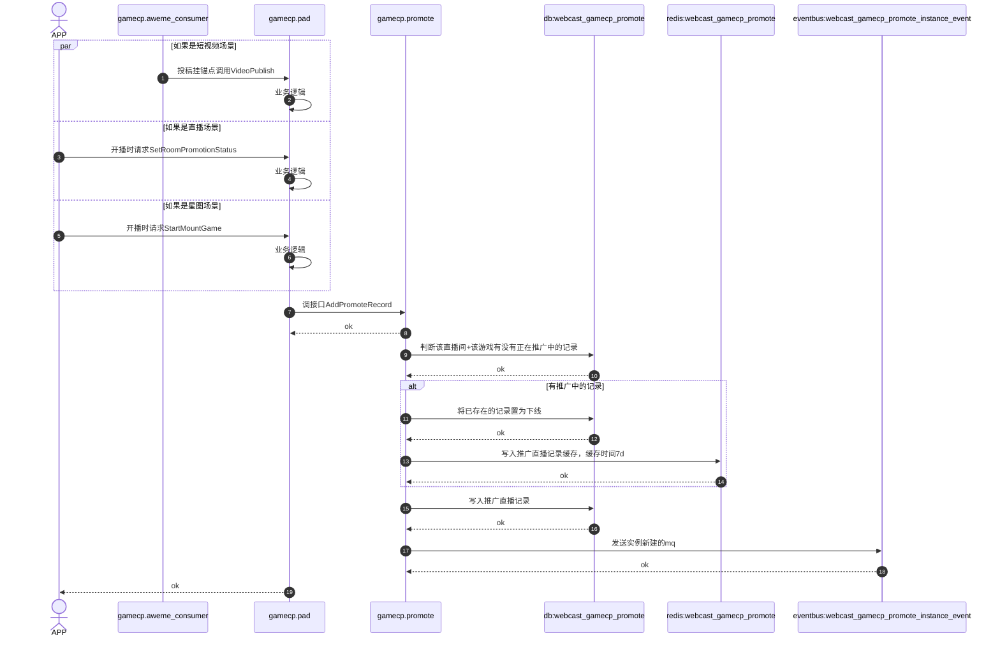

### 开发环境配置
#### 方式一 #开发环境配置 （推荐）
1. 搭建MAC本地开发环境
2. GoLand搭建CloudDev环境 配置BOE环境
3. 注意，这里BOE可以理解为是测试环境，所有代码的测试、联调、运行、Debug都是在BOE环境中进行
4. 
#### 方式二 
1. 远程开发机配置开发
2. VsCode链接开发机进行开发

### GoLand拉取代码仓库失败

1. fatal: Could not read from remote repository. 
	- 大概率是证书过期了 可以使用klist查看本地电脑证书是否过期，如果过期使用命令：
	```bash
	  kinit tongmeng.dy@BYTEDANCE.COM
	```

### Kitex

- kitex 默认会将生成代码生成在当前目录（也就是 $EXAMPLE_PATH）。这里简单说明一下参数的含义：
- `-module`参数应和 `go.mod` 文件中的 module name 相同，在本例中为 code.byted.org/your_name/kitex_example
- 常用的module参数为  code.byted.org/sysmodulename/func 举例： 
- kitex -module code.byted.org/game/tmtest \\n -service webcast.game.tmtest 
- ~/go/src/code.byted.org/webcast/rpc_idl/webcast/test/tm_test.thrift
-  `-service`参数表明需要生成服务端代码，建议指定为服务端的`PSM`（[什么是"PSM"](https://bytedance.larkoffice.com/wiki/wikcn2ZAtBJMFXuZi70ftWovxgc?bk_entity_id=enterprise_129)），在本例中为 `kitex.thrift.example`；
- - IDL 文件**必须是最后一个参数**，在本例中为 `idl/kitex_greet.thrift`。


```zsh
cd $EXAMPLE_PATH

kitex -module code.byted.org/your_name/kitex_example \
    -service kitex.thrift.example idl/kitex_greet.thrift

# this is necessary since v0.14.0+ is not compatible with Kitex
# Refer to doc "not enough arguments" error for more information
go mod edit -replace=github.com/apache/thrift=github.com/apache/thrift@v0.13.0

go mod tidy
```


## 工具相关&网站
- [CloudIDE](https://cloud.bytedance.net/cloudide/environments?x-resource-account=public)
- [CloudDEV](https://bits.bytedance.net/clouddev/interface_test?address=&api=GetOperationLogs&cluster=default&env=prod&form_type=RPC&http_method=GET&idc=boe&idl_source=1&idl_version=feat_newbee_tongmeng&protocol=https%3A%2F%2F&psm=webcast.newbee.core&test_plane=2&zone=BOE)
- [直播PB](https://code.byted.org/webcast/rpc_idl)

## 开发问题汇总
1. 客户端如何寻址到后台结构
2. 后台上线流程
3. 监控告警系统
4. Janux 前端交互 [前端协议转换](https://cloud.bytedance.net/bam/rd/webcast.gamecp.promote/idl?x-resource-account=public&cluster=default&version=1.0.1142)
5. BOE部署了服务 但是在测试接口时报错： 
	找不到服务地址，可能的原因: 1.psm不存在; 2.psm未注册consul (sd lookup {service_name} 为空), 可能是tce服务没有配置监听端口; 3.检查是否cluster/env 信息有误。 如果是在测试，可以尝试输入自定义地址 -- 已解决
6. 部分业务场景&名词不太熟悉 -- 待沟通
7. 

## 开发流程 & 规范
1. 后台更新协议(webcast_idl) $\rightarrow$ overpass根据个人分支生成代码([overpass](https://overpass.bytedance.net/idl_info?s=webcast.newbee.core)) $\rightarrow$ [bam导入IDL](https://cloud.bytedance.net/bam/rd/webcast.game.tmtest/api_doc/new_api_doc?x-resource-account=public)
2. GoLand可以搭建BOE环境测试接口
3. 使用Jsonx 并且 尽量函数要写通用
4. CR流程标准：
	1. 如果定义了新接口，接口定义完需要提交一次CR
	2. 完成接口或者函数实现，如果新增代码过多 需要拆分进行CR
	3. 完成BUG修复需要CR
5. handler 使用glog打印日志 其他使用logv2打印日志
6. 打点使用metric

#### 研发流程重点
- 需求文档梳理 $\rightarrow$ [绑定TCE&新建研发环境](https://bytecycle.bytedance.net/space/webcast_deploy/module/demand/demand/3159521873/detail?active=process&feature_space_id=dygame1)$\rightarrow$ 建立远端分支和本地分支
- 通过[直播联调平台](https://bytecycle.bytedance.net/space/webcast_deploy/)绑定对应的项目创建BOE和PPE环境，同时创建对应分支，这里是开发缓解
![[Pasted image 20240416151432.png]]
- 更新IDL文件需要去[直播研发平台](https://webcast-dev.bytedance.net/)进行创建
- 根据远端的分支如`feat_game_xigua_send_notice`创建本地dev分支`dev_feat_game_xigua_send_notice` 进行开发

## 本地开发相关文件
- Navicate root TM.123
- AweMe 抖音 1128 西瓜 32
- AnchorID 主播ID
- AnchorSettleInInfo 入驻信息 一个UID可能对应多个平台入驻信息
- MGetAnchorSettleInInfo 作者同意协议入驻AppID列表 获取到的列表即是已经同意合约的APPID列表
- MGetAccountConnectInfoByUserId：通过抖音APPID换取第三方UserID


## 组件学习归纳
### AnyCache 
- 类似的缓存有[[OpenSource & CodeSource#GroupCache 学习看板 源码学习 学习看板|GroupCache]]
### Golang源码解析 [[Language/GoLang|相关总结]]
#### Slice 
##### Go Slice 源码分析

Go语言的slice结构体定义在`runtime/slice.go`文件中，其核心结构如下：

```go
type slice struct {
    array unsafe.Pointer // 指向底层数组的指针
    len   int             // slice的长度
    cap   int             // slice的容量
}
```

slice的创建通常通过`make`函数或者直接通过数组的切片操作来完成。`make`函数的源码实现如下：

```go
func makeslice(et *_type, len, cap int) unsafe.Pointer {
    // ...内存分配和初始化操作...
    return mallocgc(mem, et, true)
}
```

slice扩容的机制在`growslice`函数中实现，当slice的容量不足以添加新元素时，会触发扩容操作：

```go
func growslice(et *_type, old slice, cap int) slice {
    // ...扩容逻辑，包括计算新容量、内存分配和数据拷贝...
    return slice{p, old.len, newcap}
}
```

##### 常见用法

1. **创建Slice**：
   ```go
   // 使用make函数创建一个长度为0，容量为3的int类型的slice
   slice := make([]int, 0, 3)
   ```

2. **追加元素**：
   ```go
   // 向slice中追加元素
   slice = append(slice, 1, 2, 3)
   ```

3. **切片操作**：
   ```go
   // 获取slice的一个子序列
   subSlice := slice[1:4] // 从第二个元素开始到第四个元素
   ```

4. **遍历Slice**：
   ```go
   // 遍历slice中的每个元素
   for i := range slice {
       fmt.Println(slice[i])
   }
   ```

5. **修改Slice元素**：
   ```go
   // 修改slice中的元素
   slice[0] = 10
   ```

##### 可能出现的错误用法

1. **超出Slice长度访问**：
   ```go
   // 错误的访问方式，可能会导致panic
   value := slice[10] // slice的长度小于11
   ```

2. **修改从函数返回的Slice**：
   ```go
   func f(s []int) {
       s[0] = 10 // 这只会修改传入的slice的副本，不会影响原始slice
   }
   ```

3. **忘记Slice扩容可能导致的性能问题**：
   ```go
   // 频繁的append操作，没有预先分配足够的容量，会导致多次扩容
   slice := make([]int, 0, 1)
   for i := 0; i < 1000; i++ {
       slice = append(slice, i)
   }
   ```

4. **错误的容量判断**：
   ```go
   // 错误的判断方式，cap是slice的总容量，不是剩余空间
   if cap(slice) == 0 {
       // 错误，这会判断slice是否已经扩容到其最大容量
   }
   ```
**注意事项** [[Language/GoLang#^727187|注意边界处拷贝]]

- Map
- sync.Map
- SingleFlight[[代码实现#SingleFlight源码|源码]]


### GoLang编码规范[[Language/GoLang|GoLang]]
### Kafka

### RocketMQ

### Mermaid语法学习
- Demo



##  Git
在 Git 中，如果你想要将一个分支（比如 `feature-branch`）的改动推送到另一个指定的分支（比如 `master` 或另一个远程的特定分支），你可以遵循以下步骤操作。这些操作包括本地分支的合并和远程分支的推送。

### 1. 确保本地仓库最新

首先，更新你的本地仓库，确保包括所有远程分支的最新改动：

bashCopy code

`git fetch --all`

### 2. 切换到目标分支

切换到你想要推送改动的目标分支（比如 `master`）：

bashCopy code

`git checkout master`

确保你的目标分支也是最新的：

bashCopy code

`git pull`

### 3. 将改动合并到目标分支

现在，你可以将改动从源分支（比如 `feature-branch`）合并到当前分支（`master`）：

bashCopy code

`git merge feature-branch`

或者，如果你想要保持历史为一个干净的直线，你可能更喜欢使用 `rebase`：

bashCopy code

`git rebase feature-branch`

### 4. 解决可能出现的冲突

如果在合并（或变基）过程中出现冲突，Git 将停止合并并让你去解决冲突。你可以通过查找项目中标记为冲突的文件来解决它们。解决后，你需要添加这些变更到暂存区：

bashCopy code

`git add <解决冲突的文件>`

如果你是在做 `rebase`，继续变基过程：

bashCopy code

`git rebase --continue`

如果是在合并，完成合并：

bashCopy code

`git commit`

### 5. 推送改动到远程仓库

一旦本地的目标分支包含了所有需要的改动，并且所有冲突都已解决，你就可以推送这些改动到远程仓库：

bashCopy code

`git push origin master`

这里，`origin` 是远程仓库的默认名称，`master` 是你将改动推送到的远程分支名。

### 6. 其他情况：直接推送到远程分支

如果你想要直接把一个分支的改动推送到远程的另一个分支（不经过本地合并），可以使用：

bashCopy code

`git push origin feature-branch:master`

这个命令将会把本地的 `feature-branch` 分支推送到远程的 `master` 分支，即使你当前不在 `master` 分支。

### 注意

- 在合并或推送前，最好确保你了解所有改动，避免错误地推送不应该的内容。
- 使用 `rebase` 可能会改变历史，如果是在公共分支上操作，需要特别小心。

通过上述步骤，你可以有效地管理你的 Git 仓库和分支，确保改动正确无误地被推送到目标分支。

当你在本地分支上进行了提交，然后从`master`拉取并合并了新的提交，最后又在本地分支上进行了更多的提交，并且现在想要忽略从`master`合并来的提交，只保留你自己的提交，并且将它们合并为一个单独的提交，你可以通过以下步骤来实现：

### 方法 1: 使用交互式变基（Interactive Rebase）

这个方法允许你重新组织提交的顺序，合并提交，或者删除不需要的提交。

1. **启动交互式变基**:
    
    假设你的本地分支名为`feature-branch`，首先找到你开始做自己工作的那个提交的哈希（即你第一个自己的提交之前的提交）。可以通过`git log`查看提交历史。然后开始交互式变基：
    
    bashCopy code
    
    `git rebase -i <commit-hash>`
    
    其中`<commit-hash>`是你自己的第一个提交之前的那个提交的哈希。
    
2. **在打开的编辑器中**:
    
    - 你会看到从指定的提交开始到当前分支的所有提交列表。
    - 把从`master`拉取的合并提交（通常是一个合并提交）标记为`drop`或者直接删除那些行。
    - 将你的提交前面的`pick`改为`squash`（合并到前一个提交）或`fixup`（合并到前一个提交且忽略该提交的提交信息）。
    
    这看起来可能是这样的：
    
    sqlCopy code
    
    `pick 1234567 Your first commit squash 89abcde Your second commit`
    
3. **保存并完成变基**:
    
    保存文件并退出编辑器，Git 会开始变基过程。如果使用`squash`，它会提示你编辑最终的提交信息。如果出现冲突，Git 会暂停让你解决冲突，然后你需要手动继续变基过程。
    

### 方法 2: 使用软重置（Soft Reset）

如果你只关心自己的提交，并希望简化操作，可以使用软重置：

1. **找到你的第一个提交前的那个提交的哈希**：
    
    使用`git log`查找你开始自己工作的那个提交的哈希。
    
2. **执行软重置**:
    
    将HEAD重置到你自己的第一个提交之前的那个提交：
    
    bashCopy code
    
    `git reset --soft <commit-hash>`
    
    其中`<commit-hash>`是你自己的第一个提交之前的那个提交的哈希。
    
3. **重新提交**:
    
    现在你的所有变更都会在暂存区。你可以创建一个新的提交：
    
    bashCopy code
    
    `git commit -m "合并我的所有改动"`
    

这些步骤会帮助你清理历史，只保留你的改动，并将它们合并成一个单独的提交。在进行这样的操作后，如果你需要将这些改动推送到远程仓库，可能需要强制推送：

bashCopy code

`git push --force`

**注意**：使用强制推送（`--force`）可能会覆盖远程分支上的提交，因此在使用之前应确保这是安全的，或者与你的团队协调一致。这种操作对共享分支来说可能会造成问题。


## 周报
佟萌4.8-4.12周报：

1. 学习字节内部相关组件，完成新手村部分任务
2. 参加需求评审：
	1. 西瓜APP补充创作相关消息通知
	2. 【消费链路】满足原发文侧筛选条件的三类游戏在西瓜侧屏蔽小手柄展示+向创作者发送站内信通知
3. 熟悉业务相关代码，整理技术方案[server技术方案-DX融合西瓜站内信和手柄消费改造](https://bytedance.larkoffice.com/docx/Q4cbdQt8Fo2DpdxZYgWciq0znab)