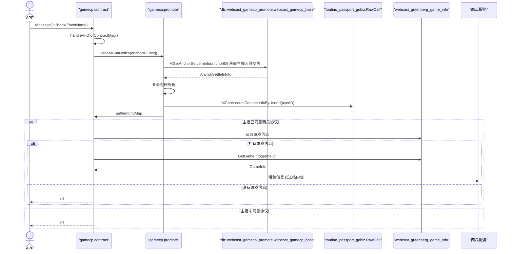

```mermaid
sequenceDiagram  
    Actor App as APP    
    participant ContractModule as "gamecp.contract"    
    participant PromoteModule as "gamecp.promote"    
	participant DB as "db: webcast_gamecp_promote.webcast_gamecp_base"    
	participant PassportService as "toutiao_passport_gobiz.RawCall"    
	participant GameInfoService as "webcast_gutenberg_game_info"    
	participant XiGuaService as "西瓜服务"  
	
App ->> ContractModule: MessageCallback(EventName)  
ContractModule ->> ContractModule: handleAnchorContractMsg()  
ContractModule ->> PromoteModule: SendXiGuaNotice(anchorID, msg)  
PromoteModule ->> DB: MGetAnchorSettleInInfo(anchorID) 获取主播入驻状态  
DB -->> PromoteModule: AnchorSettleInInfo  
PromoteModule ->> PromoteModule: 业务逻辑处理  
PromoteModule ->> PassportService: MGetAccountConnectInfoByUserId(userID)  
PromoteModule ->> ContractModule: settleInInfoMap  
  
alt 主播已同意西瓜协议  
ContractModule ->> GameInfoService: 获取游戏信息  
    alt 拥有游戏信息  
        ContractModule ->> GameInfoService: GetGameInfo(gameID)        
        GameInfoService -->> ContractModule: GameInfo        
        ContractModule ->> XiGuaService: 组装信息发送站内信  
    else 没有游戏信息  
        ContractModule -->> App: nil
    end
else 主播未同意协议  
	ContractModule -->> App: nil  
end
```