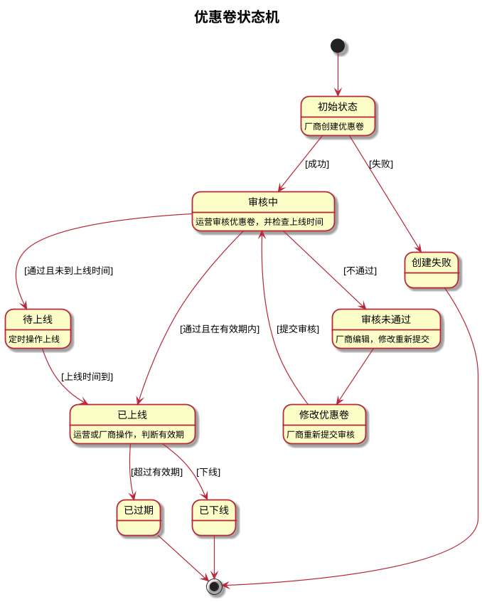
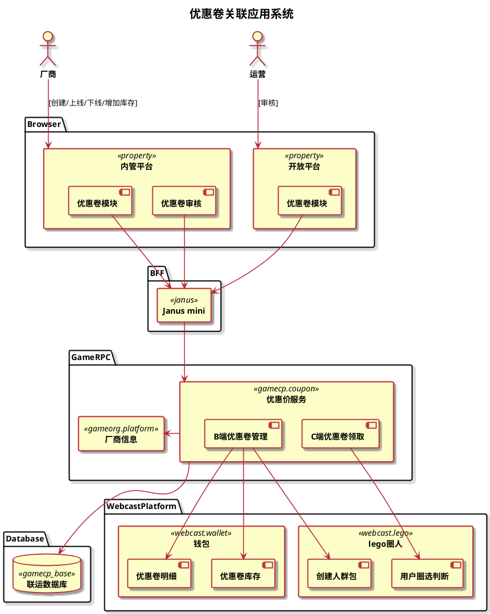
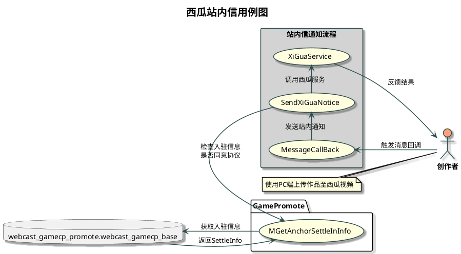

### 状态机DEMO

```plantuml
@startuml

' 阴影
skinparam shadowing true

' 状态图
skinparam State {
    ArrowColor B92637
    BorderColor B92637
    BackgroundColor FDFDC7
    BorderThickness 1.8
    ArrowThickness 1.2
}

title <size:20>优惠卷状态机</size>

' 初始状态
[*] --> 初始状态
初始状态 : 厂商创建优惠卷
初始状态 --> 审核中 : [成功]
初始状态 --> 创建失败 : [失败]
创建失败 --> [*]

' 审核通过
审核中 : 运营审核优惠卷，并检查上线时间
审核中 --> 审核未通过 : [不通过]
审核中 --> 待上线 : [通过且未到上线时间]
审核中 --> 已上线 : [通过且在有效期内]

' 审核不通过
审核未通过 : 厂商编辑，修改重新提交
审核未通过 --> 修改优惠卷
修改优惠卷 : 厂商重新提交审核
修改优惠卷 --> 审核中 : [提交审核]

'上线
' 已上线 : 运营或厂商操作下线

' 待上线
待上线 : 定时操作上线
待上线 --> 已上线 : [上线时间到]

' 下线
已上线 : 运营或厂商操作，判断有效期
已上线 --> 已下线 : [下线]
已下线 --> [*]

' 过期
已上线 --> 已过期 : [超过有效期]
已过期 --> [*]


@enduml
```

### 系统DEMO

```plantuml
@startuml  
  
' 阴影  
skinparam shadowing true  
' 类图  
skinparam class {  
    ArrowColor B92637  
    BorderColor B92637  
    ArrowThickness 1.5  
}  
' 角色  
skinparam actor {  
    BackgroundColor FDFDC7  
    BorderColor B92637  
    BorderThickness 1.8  
    FontStyle bold  
}  
' 组件  
skinparam component {  
    BackgroundColor FDFDC7  
    BorderColor B92637  
    BorderThickness 1.8  
    FontStyle bold  
}  
' 包  
skinparam package {  
    BorderColor black  
    BorderThickness 2  
}  
' 矩形框  
skinparam rectangle {  
    BackgroundColor FDFDC7  
    BorderColor B92637  
    BorderThickness 2  
    FontStyle bold  
    StereotypeFontStyle italic  
}  
' 数据库  
skinparam database {  
    BorderColor B92637  
    BackgroundColor FDFDC7  
    BorderThickness 1.8  
    FontStyle bold  
    StereotypeFontStyle italic  
}  
  
title <size:20>优惠卷关联应用系统</size>  
  
actor "厂商" as gdUser  
actor "运营" as operationUser  
  
package Browser as browser {  
  rectangle 内管平台 <<property>> as go {  
    component "优惠卷模块" as couponGO  
    component "优惠卷审核" as couponAudit  
  }  
  rectangle 开放平台 <<property>> as op {  
    component "优惠卷模块" as couponOP  
  }  
}  
  
gdUser --> go : [创建/上线/下线/增加库存]  
operationUser --> op : [审核]  
  
package BFF as bff {  
  rectangle "Janus mini" <<janus>> as janus  
}  
  
couponAudit -down-> janus  
couponGO -down-> janus  
couponOP -down-> janus  
  
package GameRPC as rpc {  
  rectangle "优惠价服务" <<gamecp.coupon>> as coupon {  
     component "B端优惠卷管理" as man  
     component "C端优惠卷领取" as cCrow  
  }  
  rectangle "厂商信息" <<gameorg.platform>> as gop  
}  
  
janus -down-> coupon  
  
package WebcastPlatform as platform {  
  rectangle "钱包" <<webcast.wallet>> as wallet {  
      component "优惠卷明细" as wDetail  
      component "优惠卷库存" as wStock  
  }  
  rectangle "lego圈人" <<webcast.lego>> as lego {  
      component "创建人群包" as legoGetPackageID  
      component "用户圈选判断" as legoCrow  
  }  
}  
  
coupon -right-> gop  
  
man  -down-> legoGetPackageID  
man  -down-> wDetail  
man  -down-> wStock  
cCrow  -down-> legoCrow  
  
package Database as db {  
  database "联运数据库" <<gamecp_base>> as baseDB  
}  
  
coupon -down-> baseDB  
  
@enduml
```

### 简单系统DEMO

```plantuml
@startuml  
  
' 阴影  
skinparam shadowing true  
  
' 类图  
skinparam class {  
    BackgroundColor PaleGreen  
    ArrowColor DarkSlateGray  
    BorderColor DarkSlateGray  
    BorderThickness 1.5  
    ArrowThickness 1.5  
    FontStyle italic  
}  
' 矩形框  
skinparam rectangle {  
    BackgroundColor LightGray  
    BorderColor DarkSlateGray  
    BorderThickness 1.5  
    shadowing true  
}  
' 用例  
skinparam usecase {  
    BackgroundColor LightYellow  
    BorderColor DarkSlateGray  
    BorderThickness 1.5  
    ArrowThickness 1.5  
}  
' 角色  
skinparam actor {  
    BackgroundColor LightSalmon  
    BorderColor DarkSlateGray  
    BorderThickness 1.5  
    FontStyle bold  
}  
' 备注  
skinparam note {  
    BackgroundColor LightYellow  
    NoteBorderColor DarkSlateGray  
    BorderThickness 1.5  
}  
  
title <size:20>西瓜站内信用例图</size>  
  
'从左往右画用例图  
left to right direction  
  
actor "创作者" as user  
note left of user: 使用PC端上传作品至西瓜视频  
  
package "GamePromote" {  
    usecase "MGetAnchorSettleInInfo" as Anchor  
}  
  
database "webcast_gamecp_promote.webcast_gamecp_base" as DB  
  
Anchor -> DB : 获取入驻信息  
DB --> Anchor: 返回SettleInfo  
  
rectangle "站内信通知流程" {  
    usecase "MessageCallBack" as MsgCallBack  
    usecase "SendXiGuaNotice" as SendMsg  
    usecase "XiGuaService" as XiGua  
}  
  
user -> MsgCallBack : 触发消息回调  
MsgCallBack -> SendMsg : 发送站内通知  
SendMsg -> XiGua : 调用西瓜服务  
XiGua --> user : 反馈结果  
  
SendMsg -> Anchor : 检查入驻信息\n是否同意协议  
  
@enduml
```