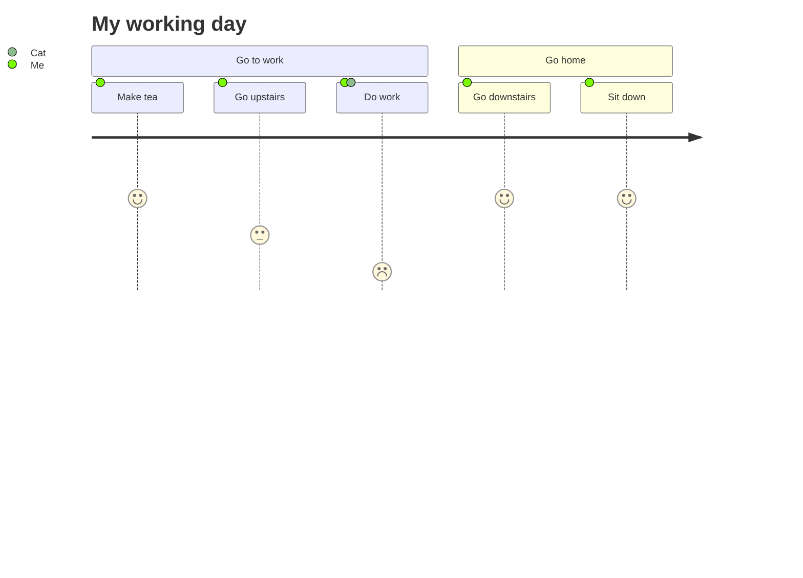

# Day planner

**这是{{date:YYYY-MM-DD}}的日计划** [[模板|每日模板]]

**Obsidian相关插件使用可以查看相关**[[Obisidian工具使用方法|Obisidian插件使用文档]]

### 上午
- [ ] 09:50起床 📅 {{date:YYYY-MM-DD}}
- [ ] 10:00洗完脸出发 📅 {{date:YYYY-MM-DD}}
- [ ] 10:30抵达公司 & 梳理今天要做的事情 📅 {{date:YYYY-MM-DD}}
- [ ] 主要看下会议和代办事项 #tasks 🔼  📅 {{date:YYYY-MM-DD}} 

### 下午
- [ ] 14:00起床办公 📅 {{date:YYYY-MM-DD}} 
- [ ] 专注于写代码 & 开会 📅 {{date:YYYY-MM-DD}}
- [ ] 18:00吃晚饭 少吃减肥 ⏫ 📅 {{date:YYYY-MM-DD}} 🔁 every day 

### 晚上
- [ ] 19:00上来开始梳理工作 📅 {{date:YYYY-MM-DD}}
- [ ] 21:30离开工位 📅 {{date:YYYY-MM-DD}}
- [ ] 22:00左右到家 娱乐 or 学习相关知识 📅 {{date:YYYY-MM-DD}}
- [ ] 02:00左右必须睡觉 📅 {{date:YYYY-MM-DD}} ⏫ 🔁 every day 

### 重要
- [ ] 总结重点仓库函数流程图 ⏫ 📅 {{date:YYYY-MM-DD}} 🔁 every week 
### 已完成tasks
```tasks
done
due today
path includes EveryDay
```


### 未完成tasks
```tasks
not done
due today
path includes EveryDay
```

### 今日心情
